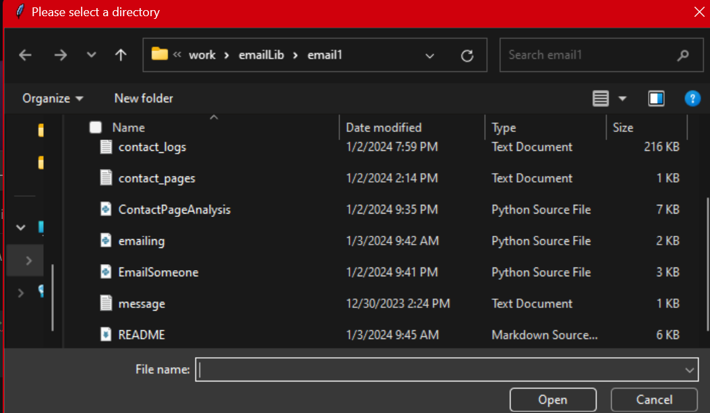

# Email Machine

### Introduction
This program uses the `selenium.webdriver` module and the Chrome WebDriver to extract faculty email addresses from multiple colleges' websites. On all of my other projects, I used the `BeautifulSoup` library. However, I ran into the problem in which the website required me to enable Javascript. `BeautifulSoup` does not have this ability. All it does is analyze the webpage's source (it's original `HTML` content without any changes made by `Javascript`). 

Then, the program implements Python's `email` module to create an email in the correct format for services like Gmail, Outlook, and Yahoo Mail. Then, this email is sent using `smtplib.send_message()`. The connection between the email server is encrypted with StartTLS and uses port 587. Then, the emails are sent!


### Setting it up
The WebDriver in this project is meant for Chrome version 120.0.6099.109 running on a 64-bit processor computer with the Windows Operating System. You can gain access to other versions of the WebDriver meant for different versions of Chrome or for different operating systems [at this link](https://chromedriver.chromium.org/downloads).

#### Step 1: Setting the WebDriver's Path
If you have to download a different version of the chrome driver than what is on this repo, you are going to need to make changes to `ContactPageAnalysis.py`. If you happen to have a 64-bit processor Windows computer, you can skip this step.

```python 
#Line 119 of ContactPageAnalysis.py
cService = webdriver.ChromeService(executable_path='./chromedriver-win64/chromedriver.exe')
```

On line 119 of `ContactPageAnalysis.py`, replace the value of the `executable_path` parameter to the path of the WebDriver you installed. Make sure to get the path to the executable file in the folder you downloaded (called `chromedriver`) and not to the folder. I recommend that you put your WebDriver in this project's folder and use a relative path for this step.


#### Step 2: Entering Your Login Info
This is where the emailing comes in. In `emailing.py`, there are two variables, `username` and `password` declared on lines 20 and 21:

```python
# Lines 20-21 of emailing.py
username = 'insert-email-here'
password = 'insert-password-here'
```

In the string of the username, enter the username that you would use while logging in to whichever email service you would use.

The password is where it gets tricky; different email servers have different security measures, and they may require you to generate separate passwords for third-party services, like this program. 

For instance, the Gmail server (`smtp.gmail.com`) requires you to enable two-factor authentication and generate an app password, which you would use as your password for a third-party service. You may also have some restrictions placed by your organization or if your Google account is being supervised by somone.

On the other hand, for the Microsoft Outlook and Hotmail server (`mail-smtp.outlook.com`), you can just directly enter the password you use while logging in to your account. Check your email service's requirements for third-party services.

#### Step 3: Adding Your SMTP Email Server
If your email has one of the following domain names (whatever comes after the `@`), then you can skip this step.

* outlook.com
* gmail.com
* hotmail.com
* yahoo.com
* aol.com
* icloud.com

Open `EmailSomeone.py` and go to line 11. You should see something like this:

```python
# Lines 11-18 of EmailSomeone.py
servers = {
        'icloud.com': 'smtp.mail.me.com',
        'outlook.com': 'smtp-mail.outlook.com',
        'hotmail.com': 'smtp-mail.outlook.com',
        'gmail.com': 'smtp.gmail.com',
        'yahoo.com': 'smtp.mail.yahoo.com',
        'aol.com': 'smtp.aol.com',
}
```
The `servers` variable is being assigned to a Python data structure known as a `dictionary`. It is similar to a Javascript object. You can look into how it works on [the Python docs](https://docs.python.org/3/tutorial/datastructures.html#dictionaries).

Add another element to this `dictionary` where the key is the domain name of you email (whatever comes after the `@`) and the value is the domain of the SMTP server of you email service provider.

#### Step 4: Writing Your Message

In order to write your message, just open the `messages.txt` file and write whatever you want to send.


#### Step 5: Installing Packages

This program uses a lot of different packages that you will most likely need to install. You can use the following commands in your command line:

```commandline
pip install tk
pip install IPython
pip install pandas
pip install selenium
```


#### Step 6: Running the Code

Once you install all the necessary modules, you can run this code in your command line. Of course, you need to have python installed. This is written in Python 3, so make sure you have Python 3 installed and are not running this program on Python 2.

Once you open your command line and change the directory to the directory this code is located in. Then, write the following command in your command line:

```commandline
python3 emailing.py
```

And that's it! The program will begin running. While the program is running, it will ask if you want to attach a file:

```commandline
>>> Welcome! Start sending email immediately by entering some of your info!
    Loading...
    Would you like to add any attachments?(Y or N): 
```

If you enter `Y`, it will open a file dialog window where you select your attachments, which should look like this:



You may have to move some windows around to see it.

Once that's done, the program will run on its own.
